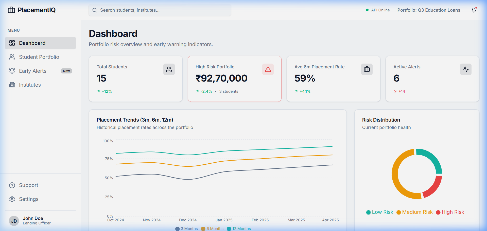
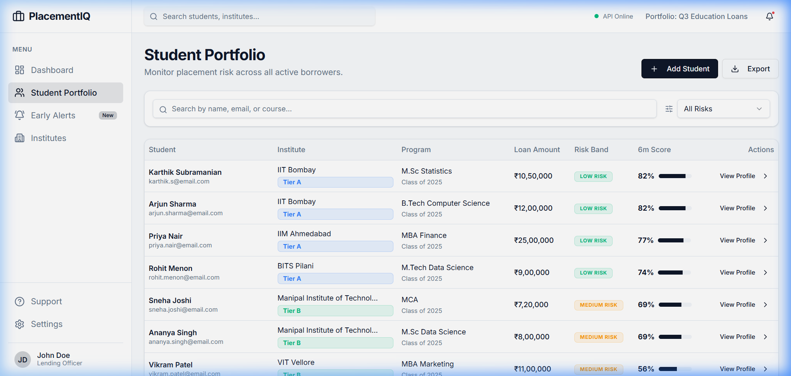
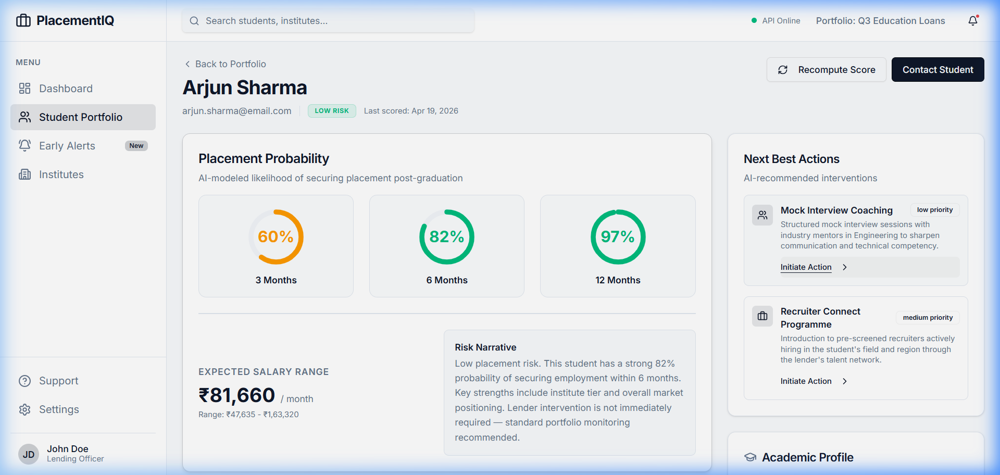

# PlacementIQ — AI-Powered Placement Risk Modeling System

## 📌 Project Overview
**PlacementIQ** is a high-fidelity fintech intelligence platform designed for education loan lenders. It provides a data-driven approach to assessing student employability, enabling lenders to proactively manage portfolio risk through early warning indicators and AI-recommended interventions.

### ⚠️ The Problem
Traditional education loan underwriting relies heavily on past academic performance (CGPA) and co-signers. However, for student borrowers, **repayment capability is entirely dependent on post-graduation placement success.** Lenders currently lack:
- **Predictive Visibility**: No way to quantify the likelihood of a student securing a job before graduation.
- **Early Intervention**: No mechanism to identify "at-risk" students early enough to improve their employability.
- **Dynamic Risk Adjustment**: Static risk models that don't account for changing market demand or real-time student activity.

### ✅ The Solution
PlacementIQ bridges this gap by introducing a **Multi-Parametric Risk Scoring Engine**. By analyzing a wide array of data points—from institute tier and field-specific market demand to individual project complexity and soft skills—PlacementIQ provides lenders with a clear, quantified view of their portfolio's future health.

---

## 🚀 Key Features

- **Executive Dashboard**: Real-time portfolio KPIs, including total exposure to high-risk segments and 6-month placement trends.
- **AI Risk Profiling**: Individualized student risk cards with probability gauges for 3, 6, and 12-month windows.
- **Early Warning System (EWS)**: An automated alert feed that flags students falling behind on placement milestones.
- **Intelligent Interventions**: AI-generated "Next Best Actions" (e.g., mock interview coaching, recruiter connects) to mitigate risk.
- **Institute Intelligence**: Benchmark data across partner institutes to optimize lending across different tiers.

---

## 🛠️ Technical Stack

- **Core Architecture**: TypeScript Monorepo (pnpm workspaces)
- **Frontend**: React + Vite, Tailwind CSS (Vanilla), Lucide Icons, Radix UI, Framer Motion
- **Data Visualization**: Recharts (Customized for glassmorphic aesthetics)
- **Backend API**: Express 5 (High-performance API server)
- **Database Layer**: PostgreSQL + Drizzle ORM
- **API Strategy**: OpenAPI Specification-first with Orval codegen for type-safe React-Query hooks.

---

## 🧠 Workflow: The AI Scoring Engine

The heart of PlacementIQ is the **AI Scoring Engine** (`artifacts/api-server/src/lib/scoring.ts`), which operates through the following stages:

1. **Multi-Vector Data Intake**:
   - **Academic**: CGPA, backlogs, and consistency.
   - **Institutional**: Institute tier, location, and historical placement cell effectiveness.
   - **Competency**: Technical certifications, project complexity, and internship quality.
   - **Market Context**: Macroeconomic climate and field-specific demand (e.g., AI vs. Traditional Engineering).

2. **Probability Modeling**:
   Calculates placement likelihood across three horizons:
   - **Short-term (3m)**: Immediate readiness.
   - **Mid-term (6m)**: Core risk metric for loan servicing.
   - **Long-term (12m)**: Ultimate safety net.

3. **Risk Categorization**:
   Assigns students into risk bands (**Low, Medium, High**) based on the 6-month placement probability, triggering specific lender workflows.

4. **Narrative Generation**:
   Produces human-readable "Risk Narratives" explaining *why* a student is at risk, extracted from model features (SHAP-style extraction).

---

## 📸 Visual Documentation

### 1. Portfolio Dashboard
An overview of total student exposure, average placement rates, and risk distribution across the loan portfolio.

### 2. Student Portfolio Management
A searchable repository allowing lending officers to monitor placement risk across all active borrowers.

### 3. Deep-Dive Risk Profile
Detailed student analysis showing probability gauges, salary estimations, and AI-recommended mitigation strategies.

---

## 🔧 Installation & Commands

### Prerequisites
- Node.js 24+
- pnpm 9+
- Docker (for PostgreSQL)

### Setup
1. Clone the repository.
2. Install dependencies: `pnpm install`
3. Spin up the database: `docker run --name placement-tracker-db -e POSTGRES_PASSWORD=password -p 5432:5432 -d postgres`
4. Seed the data: `pnpm --filter @workspace/scripts run seed`

### Key Commands
- **Frontend Dev**: `pnpm --filter @workspace/placementiq run dev`
- **Backend Dev**: `pnpm --filter @workspace/api-server run dev`
- **Codegen**: `pnpm --filter @workspace/api-spec run codegen` (Sync API spec to code)
- **Database Push**: `pnpm --filter @workspace/db run push` (Sync schema)

---

## 📂 Project Structure
- `artifacts/placementiq/` — React frontend.
- `artifacts/api-server/` — Express backend.
- `lib/api-spec/` — OpenAPI contract.
- `lib/db/` — Database schema & Drizzle client.
- `docs/screenshots/` — Project documentation images.
